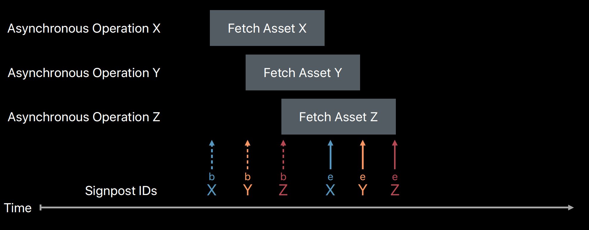
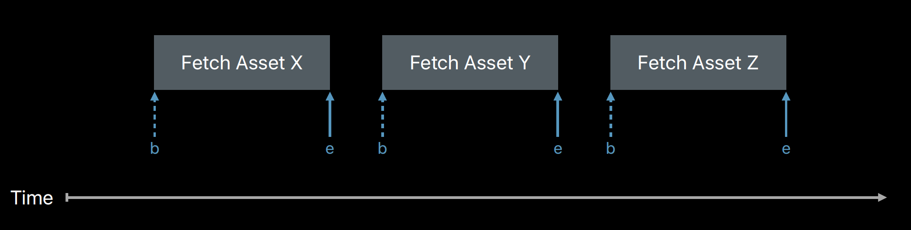

## 개발을 해보면..

개발 프로젝트 일정의 막바지에 이르게되면 어디든 버그 수정에 온 정신을 집중하게 된다.
하지만 요즘 시대의 프로그램들 완성도뿐이 아니라 사용자의 기대 Performance 수준이 높기 때문에 당연히 프로그램 동작 속도까지 체크해야한다. 

---

사실 나는 오랜 iOS 개발을 하면서 Performance 이슈는 항상 발생을 했다. 
개발을할 때 내가 집중한 부분이 다르기도 하지만, 개발자가 고려하고 생각해야하는 것들이 너무 많다.

외부적으로는 일정과 요건에 대한 기술 협의
내부적으로는 개발 아키텍처링이나 코드 자체가 옳바른 책임을 가지고 있는지 생각하고, 기획 요건에 실제 구현하면서 문제를 해결하고 또 다른 코드나 버그상황에 대해서 미리 생각해야 한다.

그래서 Performance 부분이 개발자의 머리속에서 소외될 수 있기 때문에 이것까지 잘 챙겨야 멋진 개발자될 수 있다.

아무튼. Performance를 개선하기 위해선 크개 두가지 작업이 선행되야 한다. 

1. Performance를 개선한 할 곳 (주로, 메인화면이나, 대용량 데이터를 처리한다던가 매번 그 부분은 정해져 있다.)
2. 실제 Performance가 느린 곳 찾기
3. 코드 수정 후 Performance 개선 확인

이번 포스팅에서는 2번에 대해서 이야기를 해보려고 한다.

---

## 기존의 Performance 개선 방식

첫번째는 메모리 Leak의 해결이다. 일단 메모리릭이 있으면 퍼포먼스 개선 단계가 아니다. 우선 메모리릭부터 모두 해결한다.
그런 다음 실제 속도 체크를 하는데, 
나는 TimeChecker 클래스를 만들었다.

```swift
@objc class TimeChecker: NSObject {
    static var startTime:Date?
    
    @objc static func start(){
        if startTime == nil{
            startTime = Date()
        }
    }
    
    @objc static func end(){
        if let startTime = startTime{
            let interval = Date().timeIntervalSince(startTime)
            print("TimeChecker \(interval)")
            self.startTime = nil
        }
    }
}
```

간단한게 시작 체크 시작 ```TimeChecker.start()```를 호출하고, Task가 종료되는 부분에서 ```TimeChecker.end()```를 호출하면 시작과 끝사이의 interval 시간이 표시된다.

이 방법의 문제는 여러개의 task를 동시에 Thread에서 처리할 경우 체크가 불가능하다는 단점이 있어 항상 언젠간 개선을 해야 겠다는 생각을 하고 있었다. 

그런데 마침 이번 WWDC2018에서 *Measuring Performance Using Logging* 섹션이 소개되었다.

### Signspot

Apple은 2년전에 OSLog를 소개했는데, 이것은 효율성과 Privacy를 목표로 만들었다고 한다. 그런데 이번 WWCD2018에서 소개하고 있는 Logging은 OSLog를 이용하여 Instruments에서 시각적으로 보는 방법을 소개했다.

나는 기존에 ```class TimeChecker```의 확장을 시도했다.
그 코드는 아래와 같다

```swift
@objc class TimeChecker: NSObject {
    //MARK: - Signspot
    static let osLog = OSLog(subsystem: "com.measure.signspot", category: "Create Object")
    @objc static func startOSLog(){
        if #available(iOS 12.0, *) {
            os_signpost(.begin, log: TimeChecker.osLog, name: "load")
        } else {
            // Fallback on earlier versions
        }
    }
    
    @objc static func endOSLog(){
        if #available(iOS 12.0, *) {
            os_signpost(.end, log: TimeChecker.osLog, name: "load")
        } else {
            // Fallback on earlier versions
        }
    }
}
```

간략하게 설명하면,  ```OSLog``` 의 ```init(subsystem: String, category: String)```메소드를 통해  Log Hendle 객체를 생성한다.


처음 의도
```swift
public func os_signpost(_ type: OSSignpostType, dso: UnsafeRawPointer = #dsohandle, log: OSLog, name: StaticString, signpostID: OSSignpostID = default)
```







---

### References
- [Minimal Mistakes Quick-Start Guide](https://mmistakes.github.io/minimal-mistakes/docs/quick-start-guide/)
- [Getting started with signposts](https://www.swiftbysundell.com/daily-wwdc/getting-started-with-signposts)
- [Measuring Performance Using Logging(Apple)](https://developer.apple.com/videos/play/wwdc2018/405/)
- [Measuring Performance Using Logging(ASCIIwwdc)](https://asciiwwdc.com/2018/sessions/405)

