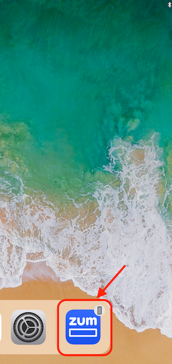
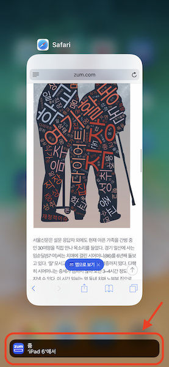

iOS Device 연속성을 보장해주기 위한 Handoff 기능에 대해서 확인해보자. 


## About Handoff

[Apple 개발자 홈페이지](https://developer.apple.com/library/archive/documentation/UserExperience/Conceptual/Handoff/HandoffFundamentals/HandoffFundamentals.html#//apple_ref/doc/uid/TP40014338)에서 handoff를 확인해보면

> Handoff is a capability introduced in iOS 8 and OS X v10.10 that transfers user activities among multiple devices associated with the same user. In iOS 9 and OS X v10.11, Handoff helps your app participate in search by making it possible to designate user activities and app states as searchable. For example, when a searchable activity or state appears in Spotlight search results or Siri suggestions, users can tap the result to return to the relevant area in your app.
>
> Handoff lets users switch from one device to another and continue an ongoing activity seamlessly, without reconfiguring each device independently. For example, a user who is browsing a long article in Safari on a Mac can move to a nearby iOS device that’s signed into iCloud with the same Apple ID and open the same webpage automatically in Safari on iOS, at the same scroll position as on the original device.

간략하게 요약하면

> Handoff 기능은 iOS8와  macOS10.10(요세미티) 버전부터 지원을 시작하였는데, 같은 유저에 대해서 다른 디바이스에 연속성을 보장해주기 위한 기능.
>

정도로 이해하면 되겠다. 

그럼, 

Handoff 기능을 이용해 다른 디바이스에서 보고있던 웹 페이지를 연속하여 보는 기능을 만들어보자.

(iPhone에서 보던 웹 페이지 → iPad에서 보기 혹은 그 반대)


## Handoff 데이터 발생하기

간단하게 `func startHandoff(url:URL)` 메소드를 만들고, 파라메터로 현재 보고 있는 웹페이지를 `NSUserActivity` 클래스를 통해 공유한다.

중요한 것은  handoff기능으 iCould를 기반으로 하기 때문에 iPhone과 iPad에 같은 Apple 계정으로 로그인 되어 있어야한다.

```swift
// Define.swift
let kUserActivityType = "com.handoff.testapp"
```

```swift
// WebViewController.swift
func startHandoff(url:URL){
    let userActivity = NSUserActivity(activityType: kUserActivityType) // type은 Bundle Identifier를 사용하면 된다.
    userActivity.webpageURL = url 		// handoff로 공유할 url
    self.userActivity = userActivity
    self.userActivity?.becomeCurrent()  // handoff event 발생
}
```


## Device 확인

Handoff 이벤트가 발생하게되면 각 디바이스에 icon이 표시된다. 

	      


## Handoff 데이터 받기

AppDelegate의

 `func application(_ application: UIApplication, continue userActivity: NSUserActivity, restorationHandler: @escaping ([UIUserActivityRestoring]?) -> Void)` 

메소드에서 콜백이 발생하게 된다.

이후 `userActivity`파라메터의 `activitytType`을 비교하고, `webpageURL`값을 이용해 WebViewController를 호출하면 된다.

```swift
// AppDelegate.swift
    func application(_ application: UIApplication, 
             continue userActivity: NSUserActivity, 
                restorationHandler: @escaping ([UIUserActivityRestoring]?) -> Void) -> Bool{
        if userActivity.activityType == kUserActivityType{
            if let webViewController = self.window.rootViewController as? WebViewController{
                webViewController.loadUrl(userActivity.webpageURL)
            }
        }
        return true
    }
```


## 결론

 어려지 않게 Handoff 기능을 구현해 보았다. 

handoff기능을 이용해 앱에서 safari 앱으로도 이벤트를 발생할 수 있는 것으로 알고있다. 

Safari로 이벤트를 발생시키는 것도 한번 알아봐야겠다. 

